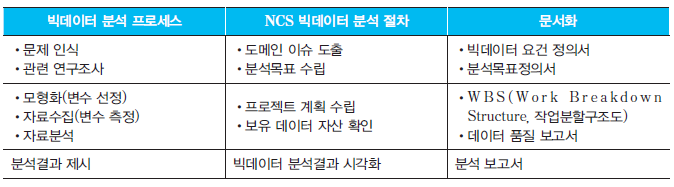

# Chapter 02. 빅데이터 분석 계획 

## 1. 분석 수행 방안 수립

### (1) 고려 사항

1. 문제에 대해 구체적 정의가 가능하고, 데이터가 존재하며, 데이터를 분석할 수 있는 분석역량을 보유하고 있는 경우 기존의 빅데이터 분석 수행 가능
2. 조건 만족 못할 경우 생성된 데이터에 대해 반복 분석해 숨겨져 있는 의미를 파악한다.
3. 분석은 인식, 연구조사, 모형화, 자료수집, 자료분석, 분석결과 제시 순서로 이루어진다.
4. 수집 → 저장 → 처리 → 분석 → 시각화 → 이용 → 폐기의 6단계

### (2) 분석 프로세스

 1. 문제 인식
  2. 관련 연구조사 : 문헌을 조사해 내용을 요약, 분류해 문제를 명확히 정의
  3. 모형화 (변수 선정) : 복잡한 현상을 단순화 하는 과정
  4. 자료 수집 (변수 측정)
     - 수집된 데이터는 Database에 저장
     - Database란 데이터의 집합을 의미 네 가지 특징 (**ACID**)
       - 원자성 : Transcations 과 관련된 작업들이 부분적으로 실행되다가 중단되지 않는 것을 보장
       - 일관성 : Transcations이 성공적으로 완료되면 일관성 있는 데이터베이스 상태로 유지
       - 고립성 : Transcations 수행 시 다른 연산 작업이 끼어들지 못하도록 보장
       - 지속성 : 성공적으로 수행된 Transcations은 영원히 반영
     - DBMS 다수의 사용자들이 컴퓨터에 수록된 자료들을 쉽고 빠르게 조회, 추가, 수정, 삭제 가능하게 하는 소프트웨어
     - 분석 대상에 대한 비스니스 모델 : 기업이 수익을 얻기 위한 일련의 활동
 5.  자료 분석
    * 데이터 속에 내재된 의미를 파악
    * 대표적 데이터 마이닝 기법으로 분류, 예측, 관련성 분석, 군집분석, 소셜네트웨크 분석 등이 있다.
 6. 분석결과 제시

    * 변수들 사이의 관련성을 포함한 데이터 분석결과를 명료하게 해석하여 의사결정자에게 구체적으로 분석결과 제시

## 2. 분석 절차 및 작업 계획 수립

### (1) 분석 절차 수립

#### ① 분석 절차 비교

#### ② NCS에서 정의한 분석 절차

- 도메인 이슈 도출 → 분석목표 수립 → 프로젝트 계획 수립 → 보유 데이터 자산 확인 → 빅데이터 분석결과 시각화

### (2) 로드맵 설정과 작업 분할 구조도 설정

#### ① WBS 절차

1. 소요비용 배분 : 수행 일정 수립 시 주어진 IT환경을 고려해 현실적인 프로젝트 계획이 되도록 해야한다. 소요비용에는 인건비, 하드웨어 구입 및 사용비용, 기타비용을 고려하여 산정
2. 프로젝트 WBS 수립 : 분석목표정의서, 프로젝트 소요비용 배분 계획을 참고해 데이터 분석 흐름에 맞게 적절히 수립
3. 프로젝트 업무 분장 계획 및 배분 : 비용 배분 계획에서 고려된 인건비 배분 기준을 중심으로 이루어지는 프로젝트 WBS의 단계별 인원투입 계획을 수립하고 역할별로 작성해야 할 필수 산출물을 정의함으로써 최종 업무 분장, 계획 및 배분 업무를 마무리한다.