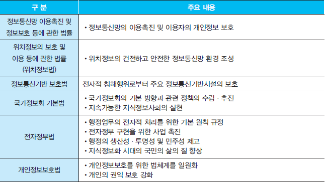
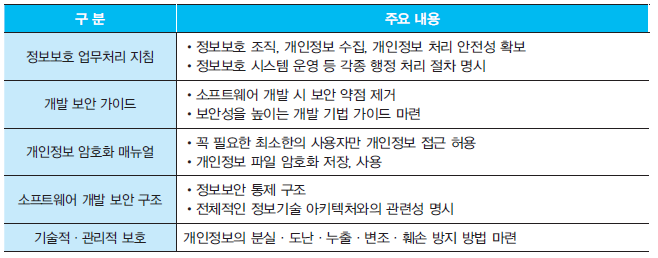
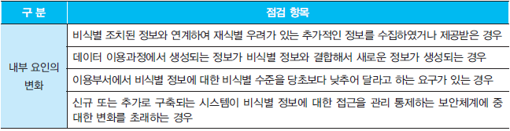
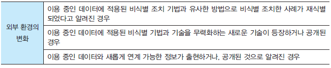

# Chapter 3 빅데이터 이해

# 1. 분석 모형과 부합하는 데이터 정의

 ## (1) 빅데이터 서비스 모델

### ① 빅데이터 의미

> 정형화된 정보, 비정형 형태의 정보가 무수히 발생해 정보 홍수나 정보 폭발이라는 개념으로 논의, 최근 '`빅데이터`' 라는 개념으로 이어짐

### ② 효과 및 전망

>  빅데이터 기술의 발전은 다변화된 현대 사회를 정확하게 예측하여 효율적인 작동에 기여. 개인화된  사회 구성원마다 맞춤형 정보를 제공, 관리, 분석 서비스 등을 제공

### ③ 산업구조

> 인프라 영역 : 데이터의 수집, 저장, 분석, 관리 등의 기능을 담당하는 컴퓨터, 단말기, 네트워크, 서버, 스토리지 등의 하드웨어와 관리, 분석 도구 등의 소프트웨어
>
> 서비스 영역 : 교육, 컨설팅, 솔루션. 데이터 정보 제공, 데이터 처리 등의 다양한 영역

### ④ 서비스 모델

 

### ⑤ 수집을 위한 사전 정보

## (2) 원시 데이터 구성 및 보관 방식

### ① 데이터 수집

#### ⓐ 데이터 유형

- 반정형 데이터 : 정형적인 데이터 구조는 아니지만 데이터 내의 레코드와 필드의 꼐층구조가 있게 하는 대크나 다른 마커를 포함하는 정형 데이터
- 비정형 : 사전에 정의된 데이터 분석 모델이 없으며, 정형화되지 않은 문서, 영상, 음성 등

#### ⓑ 내부 및 외부 데이터

- 내부 데이터 : 내부 조직 간 협의를 통한 데이터 수집, 주로 수집이 용이한 정형 데이터, 비용 및 난이도가 외부보다 유리, 서비스의 수명 주기 관리 용이
- 외부 데이터 : 외부 조직과 협의, 데이터 구매, 웹상의 오픈 데이터 등. 주로 수집이 어려운 비정형 데이터, 비용 및 난이도가 높음

#### ⓒ 수집 내용

#### ⓓ 수집 방법

* HTML : 웹 페이지를 만들 때 사용되는 문서 형식
* XML : 확장 가능한 마크업 언어, 데이터를 표현하기 위해 태그 사용
* JSON : 자바스크립트를 위해 객체 형식으로 자료 표현

#### ⓔ Web Mining

>  인터넷을 이용한 웹서비스의 다양한 패턴을 발견하기 위해 사용되는 기술. 웹페이지에서 제공되는 유용한 정보를 추출, 수집하고 분석한다.

#### ⓕ 데이터 품질 점검

#### ⓖ 내 외부 데이터 수집 시 고려사항

### ② 데이터 저장

#### ⓐ 데이터 저장 시스템

> 빅테이터 저장 시스템 : 대용량 데이터 집합을 저장하고 관리하는 시스템으로 사용자에게 데이터 신뢰성과 가용성을 보장하는 시스템

* Data Warehouse : 기업의 의사결정 과정을 지원하기 위한 주제 중심적이고 통합적이며, 시간성을 가지는 비휘발성 자료의 집합
* Data Mart : 데이터웨어하우스로부터 특정 주제, 부서중심으로 구축된 소규모 단일 주제의 데이터하우스.

#### ⓑ 저장 방식 선정

- 관계형 데이터 베이스의 단점을 극복하고, 유연하고 확장성이 있는 데이터 모델 설계를 위해 NoSQL을 많이 사용하며, 두 가지 데이터베이스 관리 시스템에 대한 주요 특징

* MongoDB의 샤딩(Sharding) 기법은 데이터를 수평분할 하는 방법으로 데이터 저장 및 관리 시 높은 성능과 가용 보장.

#### ⓒ 데이터 분산 저장 및 처리

- 분산 컴퓨팅 하드웨어 구조

* 소프트웨어 환경

#### ⓓ 클라우드 서비스

> IT 서비스로서 소프트웨어, 인프라, 플랫폼의 개념으로 발전

* SaaS (Software as a Service) : 서비스로서의 소프트웨어, 외국 포털 업체가 제공하는 문서 작성 프로그램

* IaaS (Infrastructure as a Service) : 서비스로서의 인프라. 고성능 컴퓨팅이 가능한 서버나 대용량 저장장치. ex) Amazon Web Service 등
* PaaS (Platform as a Service) : 서비스로서의 플랫폼. 사용자가 소프트웨어를 개발할 수 있는 환경

#### ⓔ 데이터 저장 시 고려사항

#### ⓕ 데이터 저장 시스템 선정

### ③ 데이터 저장 계획 수립

#### ⓐ 고려사항

#### ⓑ 데이터 저장 시스템 점검 리스트

#### ⓒ 데이터 저장 시스템 선정과정

> 빅데이터 저장 목적 파악 → 저장 방식 비교, 분석 → 기존 시스템과의 연계 검토 → 빅데이터 저장 방식 선정, 검증

#### ⓓ 문서화

## 2. 개인정보보호 및 비식별 조치

### (1) 개인정보보호 가이드라인 파악

### ① 개인정보보호의 필요성

### ② 빅데이터 개인정보보호 가이드라인

|           구분            |                       주요내용                       |
| :-----------------------: | :--------------------------------------------------: |
|     개인정보 비식별화     |      개인 식별 정보에 대한 철저한 비식별화조치       |
|        투명성 확보        | 빅데이터 처리 사실 목적 등의 공개를 통한 투명성 확보 |
|  개인정보 재식별시 조치   |    개인정보 재식별 시, 즉시 파기 및 비식별화 조치    |
|       비밀정보 처리       | 민감정보 등 통신비밀의 수집, 이용, 분석 등 처리 금지 |
| 정보의 기술적 관리적 보호 |   수집된 정보의 저장관리 시 기술적 관리적 보호조치   |

### ③ 개인정보보호 관련 법령

### ④ 개인정보보호 내규

### (2) 비식별화 및 재식별화 조치

#### ① 개인정보 비식별화 절차

- 사전검토 : 개인정보에 해당되는지의 여부 검토, 개인정보가 아닌 것이 명백할 경우 법제 ㅔ규제 없이 자유롭게 활용
- 비식별 조치 : 정보집합물에서 개인을 식별할 수 있는 요소를 전부 또는 일부 삭제, 대체하는 등의 활용, 개인을 알아볼 수 없도록 하는 조치
- 적정성 평가 : 다른 정보와 쉽게 결합하여 개인을 식별할 수 있는지를 비식별 조치, 적정성 평가단을 통해 평가
- 사후관리 : 비식별 정보 안전조치, 재식별 가능성 모니터링 등 비식별 정보 활용 과정에서 재식별 방지를 위해 필요한 조치 수행

#### ② 모니터링 점검 리스트

