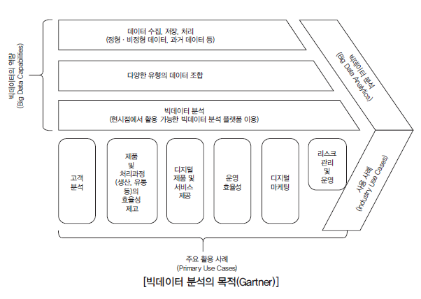
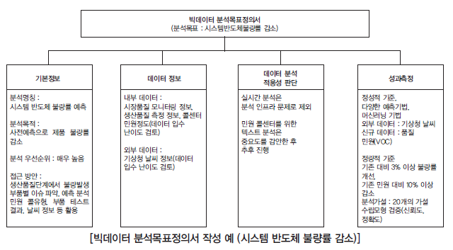

# Chapter 01 빅데이터 분석과제 정의

## 1. 빅데이터 개요

### (1) 정의

> 기존 데이터베이스 관리 도구의 능력을 넘어서는 대량의 정형, 비정형의 데이터로부터 가치를 추출하고 결과를 분석하는 기술( 분석 및 시각화 기술도 포함)

### (2) 특징

#### ① Volume (규모)

> 기술발전과 IT 서비스의 일상화로 디지털 정보량 증가, 수 Terabyte에서 수 Petabyte로 증가

#### ② Variety (다양성) 

> 로그. SNS, 위치, 구매, IOT 데이터 등 데이터 종류 증가 
>
> 텍스트, 멀티미디어 등 비정형화된 데이터 유형 증가

#### ③ Velocity (처리속도) 

> 데이터의 양과 내용이 끊임없이 변화 및 데이터 생성, 이동속도의 증가

**여기까지 빅데이터의 특징 3V** 

#### ④ Value (가치) 

> 대용량 데이터 내부에 함축된 가치를 찾는 것이 중요.
>
> 기존 DBMS 또는 분석 시스템으로는 작업이 어려움

#### ⑤ Veracity (정확성) 

> 데이터의 정확성, 타당성, 신뢰성

**여기까지 빅데이터의 특징 5V** 

* **Validity(유효성)****과 **Volarility(휘발성)**을 추가해 **7V**로 정의하기도 한다.

* 혹은 **Complexity(복잡성)**을 추가적으로 정의하기도 함.

* 빅데이터의 크기는 단일 데이터 ***집합의 크기가 수십 테라바이트에서 페타바이트에 이르며, 끊임없이 변화***

### (3) 유형

#### ① Structured Data (정형 데이터)

> 기반 시스템(기간계, EPR 등) 관리계, 정보계, 분석계 등 업무 시스템 데이터
>
> ex) 재무정보, 재고관리, 급여표, 거래정보, 인사정보 등등

#### ② Semi-Structured Data (반정형 데이터)

> 정형 구조의 데이터 모델을 준수하지 않는 정형 데이터의 형태
>
> ex) Web Log 데이터, 보안 및 특정센서 데이터, 마켓팅 정보 등 다양한 장치 데이터

#### ③ Unstructured Data (비정형 데이터)

> 그림, 동영상, 음성, 로그, 센서 데이터 Stream 등

#### ④ Big Data (빅 데이터)

> 형태나 구조가 정형화되지 않은 데이터 형식
>
> 문서, 텍스트, 이미지, 동영상, 센서 데이터, 장치 Log 데이터, 기상 데이터, SNS 데이터 등 다양한 형식의 데이터 포함.

### (4) 빅데이터 분석의 중요성

> 대규모 데이터에 대한 데이터 생성, 수집, 분석, 표현을 특징으로 하는 빅데이터 기술의 발전으로 현대 사회를 더욱 정확하게 예측하여 효율적으로 작동케 하고, 개인화된 현대 사회 구성원마다 맞춤형 정보를 제공, 관리, 분석을 가능케 한다.

### (5) 빅데이터 요소 기술

#### ① 수집

> 데이터를 검색해 수동 혹은 자동으로 수집(검색, 수집, 변환).
>
> `ETL` (Extract / Transform / Loda) 작업 수행, 수집된 데이터의 도메인 검증, 데이터 요약, 논리적 데이터 변환 및 DBMS들 사이의 데이터 변환 기능이 처리
>
> ex) 크롤링, 로그 수집기, 센싱, Open API 등

#### ② 저장

> 크기에 상관없이 저렵한 비용으로 빠르고 쉽게 저장
>
> ex) 병렬 DBMS, Hadoop, NoSQL 등

#### ③ 공유

> 시스템 간의 데이터 공유

#### ④ 처리

> 대용량 데이터의 저장, 수집, 관리, 유통, 분석 과정 처리
>
> 분산병렬, 실시간, In-Nenory 처리 등

#### ⑤ 분석

> 데이터를 효율적으로 정확하게 분석해 비즈니스에 적용
>
> 통계분석, 데이터마이닝, 텍스트마이닝, 최적화 분석 등

#### ⑥ 시각화

> 다양한 차트와 관계 등을 시각화하여 데이터 탐색 및 결과해석 등에 활용

* 주요 고려사항
  1. 분석시 데이터는 SNS, 로그 파일, 클릭 스트림 등 주로 비정형 데이터의 비중이 높다.
  2. 데이터 처리시 복잡도의 문제를 해결하기 위해 분산처리 기술이 주로 사용
  3. 분석 시 원하는 목표에 따른 분석 모델, 상관관계 분석 및 데이터 처리절차를 고려해 분석 방법선택. 새로 분석 모델을 만들어야 하는 경우도 있다.

### (6) 분석 기획 능력

#### ① NCS (국가직무능력표준, National Competency Standards)에서의 분석 기획 능력

1. 도메인 이슈 도출

	> 주어진 업무에 대한 문제점 정의 및 개선방향 도출
	> 문제점 및 이에 대한 개선 목표가 포함된 빅데이터 요건 정의서 수립
    > ***분석과제 As/Is 및 개선방향 작성***

2. 분석목표 수립

   >빅데이터 분석을 통해 얻고자 하는 목표를 정의한 분석목표 정의서 수립
   >
   >***분석목표정의서 확정***

3. 프로젝트 계획 : 

   > 빅데이터 분석을 위한 예산, 소요기간, 현재의 IT 환경을 고려해 WBS 설계
   >
   > ***프로젝트 계획 설계***

4. 보유데이터 자산 확인 

   >  분석목표와 프로젝트 계획에 따른 사전 데이터 점검.
   >
   >  데이터의 품질, 분량, 수집 경로 및 데이터 유형 점검

#### ② NCS에서 빅데이터 분석 직무 정의

> 대용량의 데이터 집합으로부터 유용한 정보를 찾고 결과를 예측하기 위해 목적에 따라 분석기술과 방법론을 기반으로 정형 · 비정형 대용량 데이터를 구축, 탐색, 분석하고 시각화를 수행하는 업무

### (7) 빅데이터와 데이터베이스

#### ① 데이터베이스(Database)와 데이터베이스 관리시스템(DBMS) 

* Database : 여러 사람에 의해 공유되어 사용될 목적으로 통합하여 관리되는 데이터 집합
* DBMS (Database Management System) : 다수의 컴퓨터 사용자들이 컴퓨터 내의 자료들을 쉽고 빠르게 조회 · 추가 · 수정 · 삭제 할 수 있도록 해주는 소프트웨어

#### ② Data 와 Information

* Data : 수, 영상, 단어 등의 형태로 된 의미 단위. 보통 연구나 조사의 바탕이 되는 재료
* Information : 특정 목적을 위해 전자적 방식으로 처리되어 부호, 문자, 음성, 음향 및 영상등을 표현하는 모든 종류의 자료 또는 지식. <u>**사용자에게 실제로 가치있거나 있을 것이라는 확신을 주어야하며 개인이나 조직이 의사결정을 할 때 사용할 수 있도록 가공 · 처리되어 의미 있고 유용한 형태로 제공**</u>. 특징으로 정확성, 적시성, 충분성, 관련성 등을 들 수 있다. 

## 2. 분석목적 설정

### (1) 빅데이터 분석 및 활용

> 1. 분석 목적은 기관마다 다르며 주로 고객분석, 제품 및 처리과정의 효율성 제고, 디지털 제품 · 서비스 제공, 운영 효율성, 디지털 마케팅, 리스크 관리 · 운영 으로 구분한다.
> 2. 기업에서 제품 차별화, 원가 절감, 소비자 행동 분석 등과 같이 고객관리, 효율성 개선, 신규 가치 창출 등의 목적으로 분석읭 목적 설정
> 3. 공공분야에서 재난 정보의 도출로 사전 재난 예방 노력

### (2) 빅데이터 분석목표 정의서

#### ① 작성방법

> 1. 분석목적 설정 후 세부 목표 설정
> 2. 목표를 명확히 하기 위해 분석목표정의서 수립
> 3. 분석별 필요한 소스 데이터, 분석방법, 데이터 입수 난이도, 분석 난이도, 분석 수행 주기, 결과에 대한 검증이 가능한 성과평가 기준 설계
> 4. 도메인 이슈 도출을 통한 개선 방향을 근거로 목표 수정

#### ② 주요 구성요소

* 데이터 원천 파악
  1. 데이터 정보조사
     * 테이블 정보와 데이터 축적기간 및 획득주기 조사
     * 문서화 작성시 필수 고려요소 : 축적기간 및 획득주기, 테이블 정보, 메타정보, 지표 존재 여부
  2. 데이터 입수 난이도 조사
     * 수집이 용이한지 여부 조사
     * 수집, 정제 프로세스, 수집 시기, 방법 및 메타정보 조사
     * 입수 난이도가 높을 경우 데이터 활용 재고
* 분석 접근 방안
  * 최종 개선 목표와 현시점의 분석목표와의 차이를 고려하여 목표 조정
  * 분석목표에 부합된 빅데이터 분석기법과 기술이라도 현시점에서 분석 · 구축 환경이 마련되지 않으면 목표 조정
* 성과 평가 기준
  1. 정성 평가
     * 분석기법 및 기술의 활용성
     * 신규 데이터 및 외부 데이터 등의 활용성
     * 세분화 및 군집화를 통한 집단 선정
     * 기타 해당 시스템별 정성적 요소 평가
  2. 정량 평가
     * 기존 분석 방법 대비 타켓팅 효과의 증감 비율
     * 확정된 유효 가설 수 , 사전 목표 대비 증감 비율
     * 측정된 데이터 모형의 정확도
     * KPI ( Key Performance Indicator 핵심성과지표)에 의한 성과측정

#### ③ 빅데이터 목표정의서 작성 예

## 3. 데이터 확보 및 분석 방안 설정

### (1) 데이터 확보 계획 수립

####  ① 수립절차

* 빅데이터 확보 계획의 수립은 보유자원과 비용이 고려되어야 한다.
* 목표정의 → 요구사항 도출 → 예산안 수립 → 계획 수립
* 데이터 확보 비용, 하드웨어 및 소프트웨어 등 시스템 운영 예산, 외부 컨설팅 비용 고려

 

|     구분      | 수행 업무                                                  | 업무 내용                                                    |
| :-----------: | :--------------------------------------------------------- | :----------------------------------------------------------- |
|   목표정의    | - 성과 목표 정의 - 성과 지표 설정                     | - 구체적인 성과목표 정의 - 성과측정을 위한 지표 개발 및 설정 - 고객 이탈률 5% 경감 혹은 매출 3% 증대등으로 설정 |
| 요구사항 도출 | 데이터 및 기술 지원과  관련된 요구사항 도출           | - 필요 데이터 확보 및 관리 계획 - 데이터 정제 수준, 저장 형태 - 시스템 혹은 도구 활용 여부 - 플랫폼 구축 여부 - 도구의 구입 또는 임차 - 외부 서비스 활용 |
|  예산안 수립  | 과제 진행을 위한 자원 및 예산 수립                         | - 데이터 확보, 구축, 정비, 관리 예산 - 하드웨어, 소프트웨어 예산 - 네트워크, 클라우드 서비스, 유지보수 비용 - 인력 및 관리 예산, 외부 예산 |
|   계획 수립   | - 인력 투입 방안 - 일정 관리 - 위험 및 품질 관리 | - 프로젝트 관리 방안 - 인력 및 역할 정의, 추진 일정 관리 - 프로젝트 실행관리, 커뮤니케이션 실행 방안 - 위험상황 발생 시 위험관리, 데이터 품질관리 |

#### ② 고려사항

- 추진일정은 분석목표정의서와 소요비용 배분계획을 중심으로 데이터 분석 흐름에 맞게 수립
- 세부적인 분석은 **분석과제 정의, 데이터 준비 및 탐색, 분석 모델링 및 검증, 산출물 정리**

#### ③ WBS (Work Breakdown Structure)

1. <u>데이터 분석과제 정의</u> : 전체 일정에 맞춰 사전 준비를 수행
2. **<u>데이터 준비 및 탐색</u>** : 처리 엔지니어와 데이터 분석가의 역할을 구분하여 세부 일정 수립
3. **<u>데이터 분석 및 모델링 검증</u>** : 실험방법 및 절차를 구분, 기획하고 검증하는 일정을 자세하게 수립
4. **<u>산출물 정리</u>** : 별도의 어플리케이션으로 연계할 경우 추가 일정을 수립

### (2) 데이터 분석 방안 설정

#### ① 빅데이터 분석 절차

- 문제 인식 : 해결하고자 하는 목적을 정의
- 관련 연구조사  : 문헌을 조사해 문제 정의 및 조사 내용을 요약 분류하여 문재 재정의
- 모형화 : 복잡한 문제를 단순화. **특징적 변수로 정의**

* 자료 수집 : 데이터 수집. 1차적으로 수집, 분석이 가능한지 확인
* 자료 분석 : 자료들에서 의미를 찾음. 변수들 사이의 관계 분석
* 분석결과 제시 : 변수들 간의 관련성을 포함해 결과 제시

**<u>*요구사항 분석, 모델링, 검증 및 테스트, 적용의 4단계로 프로세스를 설명*</u>**

#### ② 데이터마이닝 (Data Mining)

> 대규모 저장된 데이터 안에서 체계적으로 자동적으로 통계적 규칙이나 패턴을 찾는 기법. 
>
> 데이터 속의 지식 발견이라고도 하며 통계학뿐 아니라 패턴인식, 기계학습, 인공지능 등 다양한 영역에서 활용

|         구분          | 데이터 분석                                                  |
| :-------------------: | ------------------------------------------------------------ |
| 분류 (Classification) | - 일정한 집단에 대한 특정 정의를 분류 - 경쟁사 및 자사 제품 선호 고객의 분류 |
|  군집화 (Clustering)  | - 특징을 공유하는 군집 찾음 - 미리 정의된 특성에 대한 정보를 가지지 않음 |
| 연관성 (Association)  | - 동시에 발생한 사건들 사이의 관계 정의                      |
|  연속성 (Sequencing)  | - 특정 기간에 걸쳐 발생하는 관계 규명                        |
|  예측 (Forecasting)   | - 패턴을 기반으로 한 미래 예측 - 유사제품 판매실적을 이용한 신제품의 수요예측 |

- 대표적으로 k-means Clustering을 주로 이용