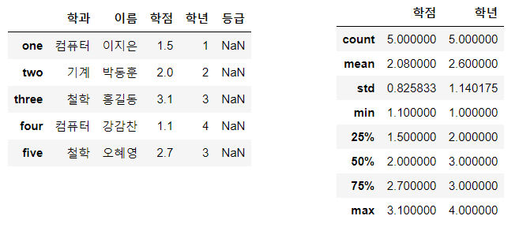
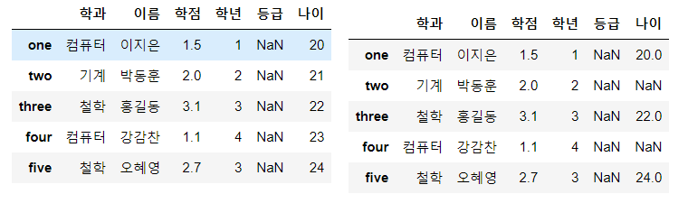
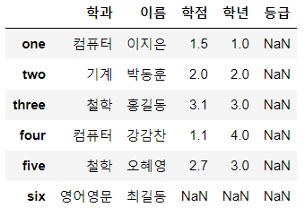
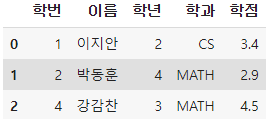
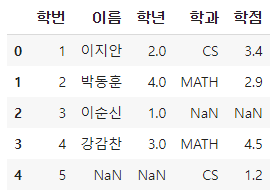
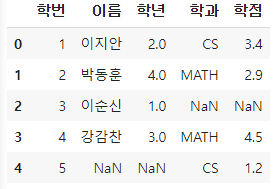

# Pandas 복습

> `Pandas`에서 자주 사용했던, 헷갈렸던 내용 정리


##### csv 파일 읽어들일 때 주의

```python
UnicodeDecodeError: 'utf-8' codec can't decode byte 0xb1 in position 0: invalid start byte
```

와 같은 error가 발생하는 이유는 `cp949`나 `euc-kr`방식으로 인코딩 되어있기 때문이다. 따라서

```python
df = pd.read_csv('open_data_korean.csv', encoding='utf-8')
```

을 이용, 혹은 Excel에서 인코딩 옵션 변경


## Indexing

```python
import numpy as np
import pandas as pd

data ={'이름' : ['이지은', '박동훈', '홍길동','강감찬','오혜영'],
      '학과':['컴퓨터','기계','철학','컴퓨터','철학'],
      '학년':[1,2,3,4,3],
      '학점':[1.5,2.0,3.1,1.1,2.7]}
df = pd.DataFrame(data, columns = ['학과','이름','학점','학년','등급'],
                 index = ['one','two','three','four','five'])
display(df)
```



### [1] column 수정

```python
# 단일 추출
df['이름']

# 내용 변경
year = df['학년'].copy()
year['one'] = 100

# 복수 추출
df[['학과','학점']]

# 새로운 column 추가
df['나이'] = [20,21,22,23,24] # 칼럼의 개수가 맞아야 한다
df['나이'] = pd.Series([20,21,22,23,24], index = ['one','two','three','four','five'])
# Series로 column을 추가할 때는 값의 대입기준이 index
df['나이'] = pd.Series([20,22,24],index = ['one','three','five'])
# 다양한 수의 데이터를 추가할 수 있다. index 기반으로 추가되기 때문에

# column 삭제
# inplace 값이 True일 경우 원본 제거
new_df = df.drop('학년',axis = 1, inplace = False)

```



### [2] Row 인덱싱

```python
# 숫자 index로 단일 indexing 불가
# slicing은 가능하다.
df[1:3]
df[1:]

# loc()를 이용한 인덱싱
df.loc['one']
df.loc['one':'three']
df.loc[['one','three']]

# iloc()
# loc와 달리 숫자 index만 가능하다.

# 행 추가, 삭제
df.loc['six',['학과','이름']] = ['영어영문','최길동'] # 이미지 추가

# drop로 삭제시 axis 1은 열, 0은 행을 의미함
df.drop('학점',axis = 1,inplace=False)
df.drop('three',axis = 0,inplace=False)
df.drop(['two','five'],axis = 0,inplace=False)
```




## DateFrame 함수

```python
# 1. sum()
df['학점'].sum() # 10.399999999999999

# 2. 데이터 정렬
df.sort_index()
df.sort_values('학점',ascending=False) # 내림차순
```

```python
# DataFrame 결합
data1 = {'학번': [1,2,3,4],
         '이름 ': ['이지안','박동훈','이순신','강감찬'], 
         '학년': [2,4,1,3]}

data2 = {'학번': [1,2,4,5],
         '학과': ['CS','MATH','MATH','CS'],
         '학점' : [3.4, 2.9, 4.5, 1.2]}

data3 = {'학과': ['CS','MATH','MATH','CS'],
         '학점' : [3.4, 2.9, 4.5, 1.2]}

df1 = pd.DataFrame(data1)
df2 = pd.DataFrame(data2)
df3 = pd.DataFrame(data3, index=[1,2,4,5])

result = pd.merge(df1,df2, on='학번', how='inner')   # 교집합
result2 = pd.merge(df1,df2, how='outer')             # 합집합
result3 = pd.merge(df1,df2, on='학번', how='outer')  # full outer join
```

  

```python
# 결측치 제거
dt = df.dropna(how='any', inplace=False)
df.loc[df['e'].isnull()]

# 대체하기
result = df.replace(np.nan, -100)
```


