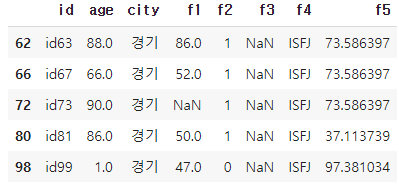

# [실기 대비] 값 변경 및 2개 이상의 조건 

>  'f4'컬럼의 값이 'ESFJ'인 데이터를 'ISFJ'로 대체하고, 'city'가 '경기'이면서 'f4'가 'ISFJ'인 데이터 중 'age'컬럼의 최대값을 출력하시오!
>
>  - 데이터셋 : basic1.csv

```python
# 라이브러리 및 데이터 불러오기
# 문제 확인
import pandas as pd
import numpy as np

df = pd.read_csv('/content/drive/MyDrive/분석기사 자격증/basic1.csv')
display(df)
print(len(df[df['f4'] == 'ESFJ'])) # 5
```

```python
# 데이터 변경
df = df.replace('ESFJ','ISFJ')
# print(len(df[df['f4'] == 'ESFJ'])) 
# 0
```

```python
# 데이터 'city'가 '경기'이며 'f4'가 'ISFJ'인 데이터
display(df[(df['city'] == '경기') & (df['f4'] == 'ISFJ')])
```



```python
df[(df['city'] == '경기') & (df['f4'] == 'ISFJ')]['age'].max()
# 90
```

