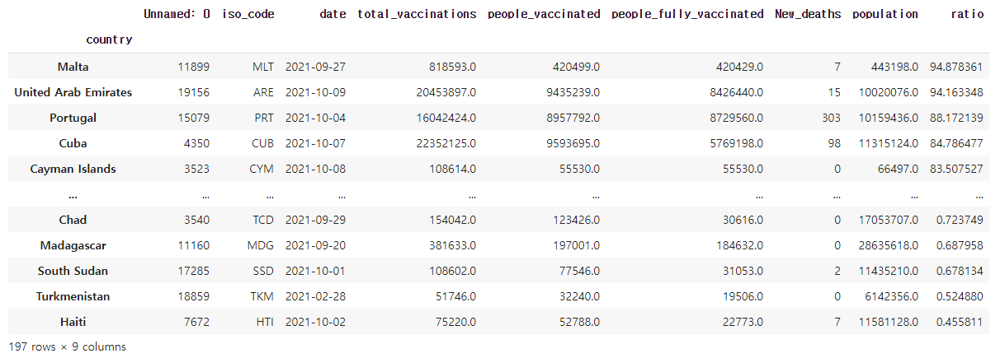
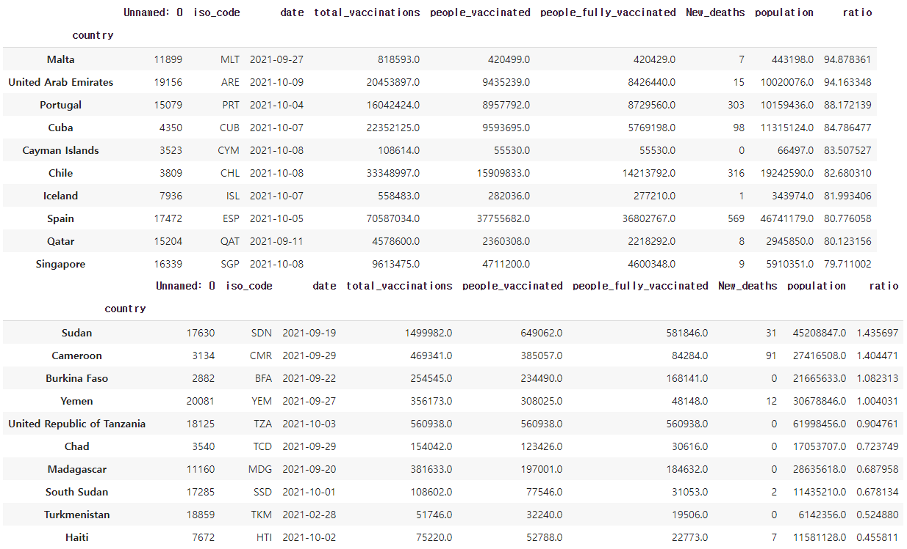

# [실기 준비] top 10 - bottom 10

> 주어진 데이터에서 상위 10개 국가의 접종률 평균과 하위 10개 국가의 접종률 평균을 구하고, 그 차이를 구해보세요 (이상치 - 100%가 넘는 접종률 제거, 소수 첫째 자리까지 출력)
>
> 결과 값은 데이터 업데이트에 따라 달라질 수 ***\*있음\****

```python
import pandas as pd
import numpy as np


df = pd.read_csv('.../covid_vaccination_vs_death_ratio.csv')
display(df.head())
```

```python
# 국가별 접종률 그룹화
# 접종률 기준 내림차순 정렬
# 이상치 제거
df = groupby('country').max()
df = df.sort_values('ratio', ascending = False)
df = df[df['ratio'] < 100]
```



```python
df_head = df.head(10)
df_tail = df.tail(10)
display(df_head)
display(df_tail)

h = df_head['ratio'].mean()
t = df_tail['ratio'].mean()

print(round(h-t,1)) # 84.2
```



