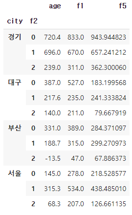

# [실기 준비] Group by Sum

> 결측치 제거 및 그룹 합계에서 조건에 맞는 값 찾아 출력
> - 주어진 데이터 중 basic1.csv에서 'f1'컬럼 결측 데이터를 제거하고, 'city'와 'f2'을 기준으로 묶어 합계를 구하고, 'city가 경기이면서 f2가 0'인 조건에 만족하는 f1 값을 구하시오
> - 데이터셋 : basic1.csv
```python
# 라이브러리 호출 및 데이터 불러오기
import pandas as pd
import numpy as np

df = pd.read_csv('.../basic1.csv')
```

```python
# 'f1' 칼럼 중 결측 데이터 제거

df = df[~df['f1'].isnull()]
# df_copy = df[df_copy['f1'].isnull() != True]
# data = data[data['f1'].notnull()]
```

```python
# 'city', 'f2' 칼럼 기준으로 묶어 합계 구하기
df2 = df.groupby(['city','f2']).sum()
display(df2)
```



```python
# 'city가 경기이면서 f2가 0'인 조건에 만족하는 f1 값
# 위의 df2를 확인하면 조건에 해당하는 인덱스는 0 이므로
print(df2.iloc[0]['f1'])
# 혹은
print(df.loc[('경기',0)]['f1'])
# 833.0
```

