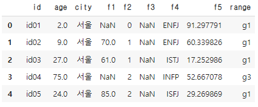

# [실기 준비] 나이 구간 나누기

> basic1 데이터 중 'age'컬럼 이상치를 제거하고, 동일한 개수로 나이 순으로 3그룹으로 나눈 뒤 각 그룹의 중앙값을 더하시오 (이상치는 음수(0포함), 소수점 값)

```python
# 라이브러리, 데이터 불러오기

import pandas as pd
import numpy as np

df = pd.read_csv('.../basic1.csv')

display(df.head())
print(df.shape) # (100,8)
```

```python
# 이상치 제거 _ 음수제거
df = df[~(df['age'] <= 0)]
print(df.shape) # (96,8)

# 이상치 제거 _ 소수점 값
df = df[df['age'] == round(df['age'])]
print(df.shape) # (90,8)
```

```python
# 동일한 개수로 3그룹을 나누기
df['range'] = pd.qcut(df['age'], q = 3, labels = ['g1','g2','g3'])
print(df['range'].value_counts())
# g3    30
# g2    30
# g1    30
display(df)
```



```python
g1_med = df[df['range'] == 'g1']['age'].median() # 22.5 
g2_med = df[df['range'] == 'g2']['age'].median() # 55.5 
g3_med = df[df['range'] == 'g3']['age'].median() # 87.0

print(g1_med+ g2_med+ g3_med ) # 165
```

