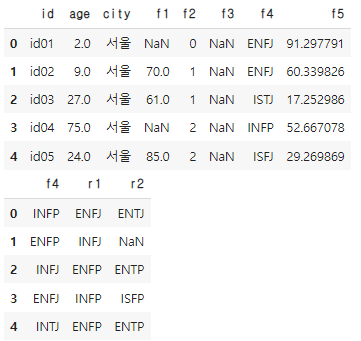
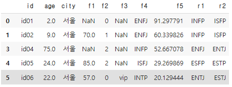

# [실기 준비] 데이터 병합

> 고객과 잘 맞는 타입 추천 :) basic1 데이터 중 'f4'를 기준으로 basic3 데이터 'f4'값을 기준으로 병합하고, 병합한 데이터에서 r2결측치를 제거한다음, 앞에서 부터 20개 데이터를 선택하고 'f2'컬럼 합을 구하시오

```python
# 데이터 불러오기
import pandas as pd
import numpy as np

df1 = pd.read_csv('.../basic1.csv')
df3 = pd.read_csv('.../basic3.csv')

display(df1.head())
display(df3.head())
```



```python
# 테이블 'f4' 기준 합치기
df = pd.merge(left = df1 , right = df3, how = "left", on = "f4")
```



```python
# 결측치 확인 및 결측치 제거
df.isnull().sum()
# id       0
# age      0
# city     0
# f1      31
# f2       0
# f3      95
# f4       0
# f5       0
# r1       0
# r2      17
# dtype: int64
df = df.dropna(subset = ['r2'])

# 상위 20개의 'f2'값들의 
answer = df.head(20)['f2'].sum()
answer # 15
```

