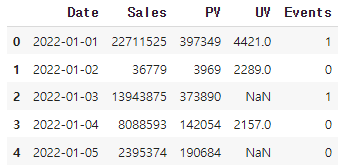
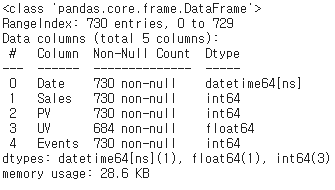
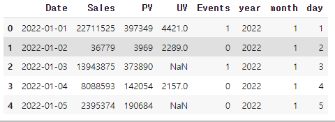

# [실기 준비] 시계열 데이터1

> 2022년 5월 Sales의 중앙값을 구하라.
>
> 데이터셋 : basic2.csv

```python
# 데이터, 라이브러리 불러오기
import pandas as pd
import numpy as np

df = pd.read_csv('.../basic2.csv')
display(df.head())
```



```python
# 'Date' 칼럼 타입 변환
df['Date'] = pd.to_datetime(df['Date'])
df.info()
```



```python
# 년, 월, 일 별로 칼럼 재 구성
df['year'] = df['Date'].dt.year
df['month'] = df['Date'].dt.month
df['day'] = df['Date'].dt.day
display(df.head())
```



```python
# 2022년 5월의 Sales 데이터의 중앙값 출력
df[(df['year']==2022) & (df['month'] == 5)]['Sales'].median()
# 1477685.0
```

