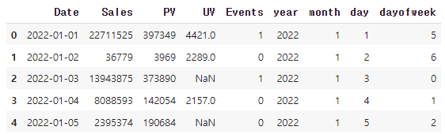

# [실기 준비] 시계열 데이터2

> 주어진 데이터에서 2022년 5월 주말과 평일의 sales컬럼 평균값 차이를 구하시오 (소수점 둘째자리까지 출력, 반올림)
>
> 데이터셋 : basic2.csv

```python
# 데이터, 라이브러리 불러오기
import pandas as pd
import numpy as np

df = pd.read_csv('.../basic2.csv')
display(df.head())
```

```python
# 'Date' 칼럼 타입 변환
df['Date'] = pd.to_datetime(df['Date'])

# 년, 월, 일, 요일 별로 칼럼 재 구성
# 요일의 경우 0 = 월요일, 1 = 화요일, 2 = 수요일, 3 = 목요일, 4 = 금요일, 5 = 토요일, 6 = 일요일
df['year'] = df['Date'].dt.year
df['month'] = df['Date'].dt.month
df['day'] = df['Date'].dt.day
df['dayofweek'] =  df['Date'].dt.weekday

display(df.head())
```




```python
# 주말, 주중의 조건을 미리 설정
weekend_c = (df['year'] == 2022) & (df['month'] == 5) & (df['dayofweek'] >= 5)

weekday_c = (df['year'] == 2022) & (df['month'] == 5) & (df['dayofweek'] < 5)
```

```python
# 주말, 주중의 Sales의 평균 구하고, 계산
weekend = df[weekend_c]['Sales'].mean()
weekday = df[weekday_c]['Sales'].mean()

round(weekend - weekday, 2) # 3010339.1
```

