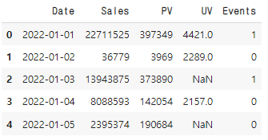
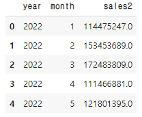

# [실기 준비] 시계열 데이터3

> 주어진 데이터에서 2022년 월별 Sales 합계 중 가장 큰 금액과 2023년 월별 Sales 합계 중 가장 큰 금액의 차이를 절대값으로 구하시오.
>
>  단 Events컬럼이 '1'인경우 80%의 Salse값만 반영함 (최종값은 소수점 반올림 후 정수 출력)

```python
# 데이터, 라이브러리 불러오기
# Date 타입별 칼럼 추가
import pandas as pd
import numpy as np

df = pd.read_csv('.../basic2.csv')

df['Date'] = pd.to_datetime(df['Date'])
df['year'] = df['Date'].dt.year
df['month'] = df['Date'].dt.month
```



```python
# Events 컬럼이 1인 경우 80% Sales값만 반영
df.loc[df['Events'] == 1, 'sales2'] = df['Sales'] * 0.8
df.loc[df['Events'] == 0, 'sales2'] = df['Sales']
```

```python
# 각 년도별 월별 sales 합계 중 최댓값
df22 = df[df['year']==2022]
df23 = df[df['year']==2023]

df_22g = df22.groupby('month')['sales2'].sum().max()
df_23g = df23.groupby('month')['sales2'].sum().max()

round(abs(df22_g - df23_g)) # 42473436
```


## 다른 방식

```python
import pandas as pd

# 데이터 불러오기 (datatime컬럼 지정)
df = pd.read_csv('.../basic2.csv')

# year, month 컬럼 생성
df['year'] = df['Date'].dt.year
df['month'] = df['Date'].dt.month

# 보정 Sales 열 생성
df.loc[df['Events'] == 1, 'sales2'] = round(df['Sales'] * 0.8)
df.loc[df['Events'] == 0, 'sales2'] = df['Sales']

# year, month 기준 groupby table 생성
df_gp = df.groupby(['year', 'month'])[['sales2']].sum()
df_gp.reset_index(inplace=True)
display(df_gp)

# 2022년 월별 Sales 합계 중 가장 큰 금액과 2022년 월별 Sales 합계 중 가장 큰 금액의 차이 절대값
df_22 = df_gp.loc[df_gp['year'] == 2022, 'sales2'].max()
df_23 = df_gp.loc[df_gp['year'] == 2023, 'sales2'].max()
print(abs(df_22 - df_23))
```



