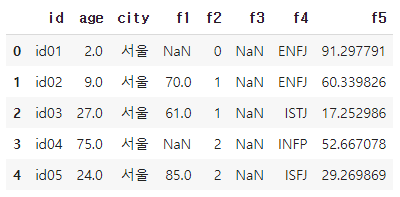
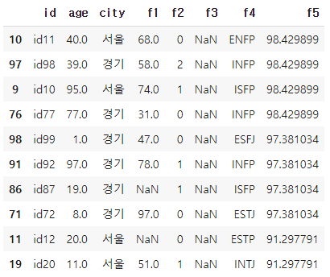
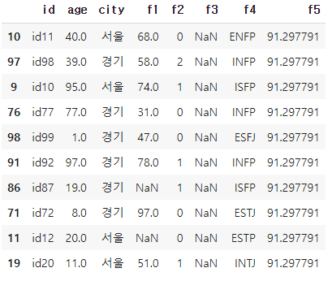

# [실기 준비 ] 작업형 1형 문제

파일 예시

```python
import pandas as pd

df = pd.read_csv('.../basic1.csv')
df.head()
```



## 연습 문제 1

- 데이터 셋의 `f5` 칼럼을 기준으로 상위 10개의 데이터 구하고

- `f5` 칼럼 10개 중 최소값으로 데이터를 대체 후

- 'age' 칼럼에서 80 이상인 데이터의 `f5` 칼럼 평균값 구하기

```python
df = df.sort_values('f5',ascending = False)
# 'f5' 기준 상위 10개의 데이터
min = df['f5'][:10].min()
# 10개중 최소값
df['f5'][:9] = min
```

      

```python
mean = df[df['age']>=80]['f5'].mean()
# 62.497747125217394
```


## 연습 문제 2

- 데이터셋의 앞에서 순서대로 70% 데이터만 활용
- 'f1' 컬럼 결측치를 중앙값으로 채우기 전후의 표준편차를 구하고
- 두 표준편차 차이 계산하기

```python
# 데이터 나누기
df.shape() # (100,8)
data70 = df.iloc[:70]
# data70, data30 = np.split(df, [int(.7 * shape(df))])
```

```python
# 결측치 채우기 전 표준편차
std1 = np.std(data70['f1'])
# 17.794892986121205
```

```python
# 결측치 채운 후 표준편차
med = data70['f1'].median()
data70['f1'] = data70['f1'].fillna(med)

std2 = np.std(data70['f1'])
# 14.585462429615124
```

```python
std1 - std2
# 3.2094305565060814
```


## 연습 문제 3

- 데이터셋의 `age` 이상치를 더하기
- 단 평균에서 표준오차 1.5를 벗어나는 영역을 이상치라고 판단

```python
std = np.std(df['age']) * 1.5
mean = df['age'].mean()

max_out = mean + std
min_out = mean - std

age = df[(df['age'] > max_out)|(df['age'] < min_out)]['age'].sum()
# age = 473.5
```


## 연습문제 4
- 이상치 찾기
- 소수점이 있는 나이를 찾고 올림, 내림, 버림 했을 때 모두 이상치 'age' 평균을 구한 다음 더하라
- 올림 `np.ceil()`, 내림 `np.floor()`, 버림 `np.trunc()`

```python
# 소수점 나이 찾기
df = df[(df['age'] - np.floor(df['age'])) != 0]
# df['age']에서 값을 반올림 내림한 값들을 빼면 소수점이 남는 값들만 남기 때문에 사용 

# 올림
m_ceil = np.ceil(df['age']).mean()
# 내림
m_floor = np.floor(df['age']).mean()
# 버림
m_trunc = np.trunc(df['age']).mean()

print(m_ceil + m_floor + m_trunc)
```


## 연습문제 5

- 결측치 처리

- 주어진 데이터에서 결측치가 80%이상 되는 컬럼은(변수는) 삭제하고, 80% 미만인 결측치가 있는 컬럼은 'city'별 중앙값으로 값을 대체하고 'f1'컬럼의 평균값을 출력

```python
# data 확인
df.isnull().sum()
# id       0
# age      0
# city     0
# f1      31
# f2       0
# f3      95
# f4       0
# f5       0
# dtype: int64
# df.shape()가 (100,8)이기 때문에 `f3`을 삭제해야 한다.
```

```python
# 'f3' 칼럼 삭제
df = df.drop('f3', axis = 1)

# 데이터 확인
df['city'].value_counts()
# 경기    41
# 대구    20
# 서울    20
# 부산    19
# Name: city, dtype: int64
```

```python
s = df[df['city'] == '서울']['f1'].median()
d = df[df['city'] == '대구']['f1'].median()
k = df[df['city'] == '경기']['f1'].median()
b = df[df['city'] == '부산']['f1'].median()

df['f1'] = df['f1'].fillna(df['city'].map({'서울':s, '대구':d, '경기':k, '부산':b}))
print(df['f1'].mean()) # 65.52
```

