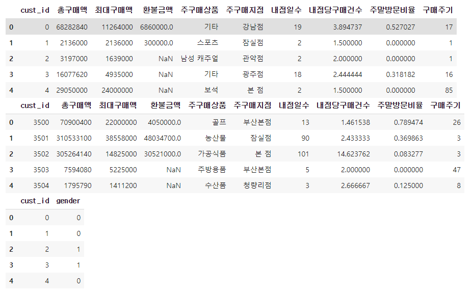
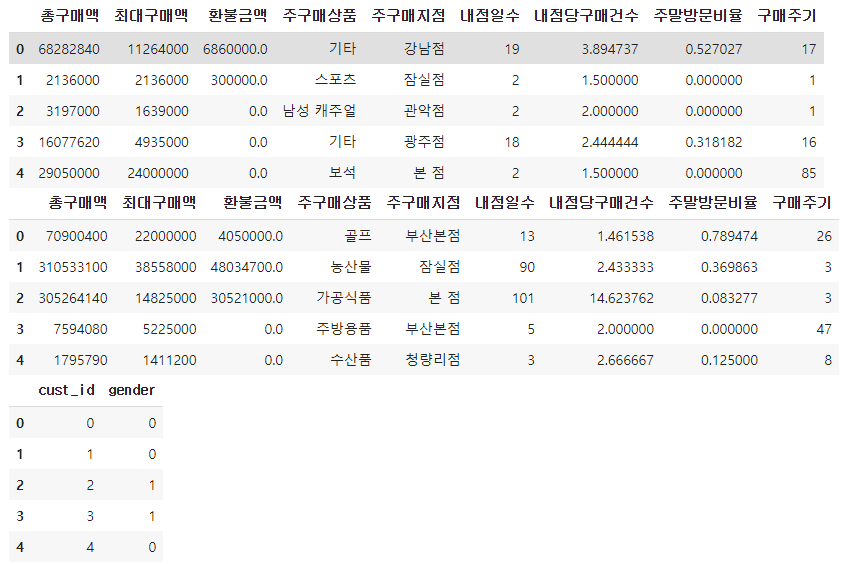
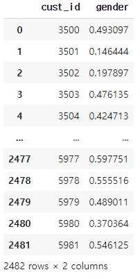

# [실기 준비] 작업형2

> 백화점 고객의 1년 간 구매 데이터
>
> - 고객 3,500명에 대한 학습용 데이터(y_train, X_train)를 이용해 성별예측 모형을 만든 후 이를 평가용 데이터 (X_test)에 적용해 얻은 2,482명 고객의 성별 예측값(남자일 확률)을 다음과 같은 형식의 CSV파일로 생성
> - 적절한 데이터 전처리, Feature Engineering, 분류 알고리즘 사용, 초매개변수 최적화, 모형 앙상블 등이 수반되어야 한다.
> - 수험번호.csv파일이 만들어지도록 코드 제출
> - 제출 모델은 ROC-AUC 평가지표에 따라 채점
> - dataset은 data/y_train.csv 형태로 읽어들인다


## 라이브러리 및 데이터 불러오기

```python
import pandas as pd
from sklearn.preprocessing import LabelEncoder
from sklearn.impute import SimpleImputer

X = pd.read_csv('.../X_train.csv', sep= ',', encoding = 'CP949')
test = pd.read_csv('.../X_test.csv', sep= ',', encoding = 'CP949')
y = pd.read_csv('.../y_train.csv', sep= ',', encoding = 'CP949')
```




## EDA

```python
# 결측지 제거
# 환불금액 col만 결측치, 0으로 대체
X = X.fillna(0)
test = test.fillna(0)

# cust_id는 예측에 필요없으므로 제거
X = X.drop(['cust_id'],axis =1)
cust_id = test.pop('cust_id')

# sklearn을 이용한 결측치 제거
# from sklearn.imput import SimpleImputer
# imp_mean = SimpleImputer(missing_values=np.nan, strategy = 'mean')
# imp_mean.transform(X)
```



```python
from sklearn.preprocessing import LabelEncoder

cols = ['주구매상품','주구매지점']
for col in cols:
  le = LabelEncoder()
  X[col] = le.fit_transform(X[col])
  test[col] = le.fit_transform(test[col])

# 다른 방식
# x_train.loc[:,['주구매상품','주구매지점']] = \
# x_train.loc[:,['주구매상품','주구매지점']].apply(LabelEncoder().fit_transform)
```


# 모델링, 하이퍼파라미터 튜닝 & 앙상블


## (1) 랜덤 포레스트

> RandomForestClassifier의 파라미터
>
> - random_state : 난수 seed 설정
> - n_estimators : 모델에서 사용할 트리 개수
> - max_depth : 트리의 최대 깊이

```python
from sklearn.ensemble import RandomForestClassifier

md = RandomForestClassifier(random_state = 2022, n_estimators = 100, max_depth = 10)
md.fit(X,y['gender'])
predictions = md.predict_proba(test)

output = pd.DataFrame({'cust_id':cust_id, 'gender':predictions[:,1]})
output.to_csv('0000.csv', index=False)

output
```



## (2) 로지스틱 회귀

> LogisticRegression 파라미터
>
> - C : 규칙의 강도의 역수 값
> - random_state : 랜덤 seed 생성

```python
from sklearn.linear_model import LogisticRegression
md = LogisticRegression(C =1, random_state = 0)
md.fit(x_train, y_train) # 학습과정
# print('score : ', md.score(x_train, y_train)) 정확도

pred = md.predict_proba(x_test) # 평가데이터에 대해서 확률 추정
pred = pd.DataFrame(pred) # DataFrame로 저장
pred = pred.iloc[:,1] 

y_test = '0000.csv' # 수험번호로 제출할 내용
ans = pd.concat([x_id,pred], axis = 1)
ans.to_csv(y_test, index = False)
ans
# 남자(1)일 확률 구하라
```


## (3) K- Nearest Neighbor

> KNeighborsClassifier 파라미터
>
> - n_neighbors : 이웃 수, 작은 수면 overfitting, 어느 정도 큰 수여야 함
> - metric : 거리 측정 방법
>   - manhattan : x, y 좌표 거리 차이
>   - euclidean : 직선 거리
> - weights 
>   - uniform : 거리에 가중치 부여하지 않음
>   - distance : 거리에 가중치 부여

```python
from sklearn.neighbors import KNeighborsClassifier
# 수치 예측일 경우 Classifier가 아닌 다른 모델
# KNeighborsRegressor

md = KNeighborsClassifier(n_neighbors = 3, metric = 'euclidean')
# 이웃 수 3, euclidean 직선거리에 따른 이웃
md.fit(x_train, y_train) # 학습과정
print('score : ', md.score(x_train, y_train))

pred = md.predict_proba(x_test) # 평가데이터에 대해서 확률 추정
pred = pd.DataFrame(pred) # DataFrame로 저장
pred = pred.iloc[:,1] 

y_test = '0000.csv' # 수험번호로 제출할 내용
ans = pd.concat([x_id,pred], axis = 1)
ans.to_csv(y_test, index = False)
ans
```


## (4) Decision Tree

> Decision Tree 파라미터 
>
> - random_state : 난수 seed 설정
> - max_depth : 트리의 최대 깊이 (값이 클수록 모델의 복잡도가 올라간다.)

```python
from sklearn.tree import DecisionTreeClassifier

md = DecisionTreeClassifier(random_state = 0, max_depth = 20)
md.fit(x_train,y_train)
print('score : ', md.score(x_train, y_train))

pred = md.predict_proba(x_test) # 평가데이터에 대해서 확률 추정
pred = pd.DataFrame(pred) # DataFrame로 저장
pred = pred.iloc[:,1] 

y_test = '0000.csv' # 수험번호로 제출할 내용
ans = pd.concat([x_id,pred], axis = 1)
ans.to_csv(y_test, index = False)
ans
```


## (5) Support Vector Machine

> SVC의 파라미터
>
> - gamma변수와 C변수를 조절하여 튜닝
> - gamma 매개변수는 하나의 훈련 샘플이 미치는 영향의 범위를 결정한다.
> - C 매개변수는 각 포인트의 중요도(정확히는 dualcoef 값)를 제한하는 매개변수로, 해당값이 커질수록 결정경계가 데이터에 정확하게 맞춰진다.

```python
from sklearn.svm import SVC
# SVR은 수치 예측
md = SVC(C = 10, gamma = 1, random_state = 0, probability =True)
# probability = True는 반드시 추가해야한다.
md.fit(x_train,y_train)

pred = md.predict_proba(x_test) # 평가데이터에 대해서 확률 추정
pred = pd.DataFrame(pred) # DataFrame로 저장
pred = pred.iloc[:,1] 

y_test = '0000.csv' # 수험번호로 제출할 내용
ans = pd.concat([x_id,pred], axis = 1)
ans.to_csv(y_test, index = False)
ans
```


## (6) 신경망

> MLPClassifier 파라미터
>
> - hidden_layer_sizes : 은닉층(hidden layer)의 개수
> - alpha : 정규화 파라미터
> - learning_rate : 가중치를 업데이트 할때 크기 제어
> - solver : 가중치 최적화를 위해 사용하는 함수 default = 'adam'

```python
from sklearn.neural_network import MLPClassifier

md = MLPClassifier(random_state = 0,alpha = 0.02, hidden_layer_sizes = [100])
# probability = True는 반드시 추가해야한다.
md.fit(x_train,y_train)
print('score : ', md.score(x_train, y_train))

pred = md.predict_proba(x_test) # 평가데이터에 대해서 확률 추정
pred = pd.DataFrame(pred) # DataFrame로 저장
pred = pred.iloc[:,1] 

y_test = 'Jin.csv' # 수험번호로 제출할 내용
ans = pd.concat([x_id,pred], axis = 1)
ans.to_csv(y_test, index = False)
ans
```

