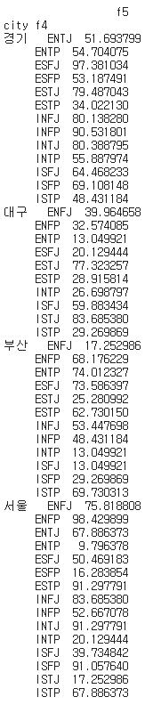

# [실기 준비] 조건에 따른 상위값 예측

> city, 'f4' 기준으로 f5 평균값을 구하고, f5 상위 7개 값을 모두 더해 출력 소수 둘째자리까지 출력

```python
# 데이터 및 라이브러리 불러오기
import pandas as pd
import numpy as np

df = pd.read_csv('/content/drive/MyDrive/분석기사 자격증/basic1.csv')
df.head()
```

```python
# 'city', 'f4' 기준으로 'f5'의 평균 구하기
ad = df.groupby(['city','f4'])[['f5']].mean()
print(ad)
```



```python
# 내림차순 정렬 후 상위 7개의 데이터의 값을 더해 소수점 둘째자리까지 출력
ad = ad.sort_values('f5', ascending = False).head(7)['f5'].sum()
print(round(ad,2)) # 643.68
```


