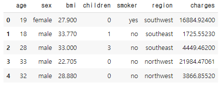
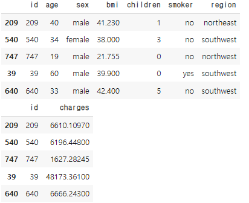
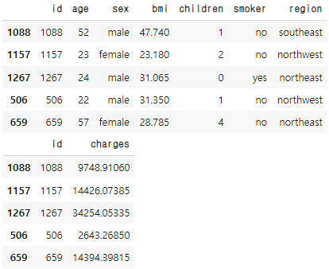
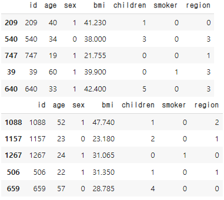
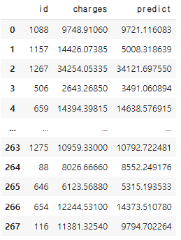

# [실기 준비] Insurance Starter

```python
import pandas as pd

df = pd.read_csv('.../insurance.csv')

df.head()
```



```python
from sklearn.model_selection import train_test_split

df = df.reset_index().rename(columns = {'index':'id'})
# display(df)

x_train, x_test = train_test_split(df, test_size = 0.2, random_state = 2021)

y_train = x_train[['id','charges']]
x_train.drop(columns = ['charges'], axis = 1, inplace = True)

y_test = x_test[['id','charges']]
x_test.drop(columns =['charges'], axis = 1,inplace = True)

display(x_train.head())
display(y_train.head())
display(x_test.head())
display(y_test.head())
x_train.shape, y_train.shape ,x_test.shape ,y_test.shape
```

  

```python
from sklearn.preprocessing import LabelEncoder

le = LabelEncoder()

cols = x_train.select_dtypes('object').columns

for col in cols:
  x_train[col] = le.fit_transform(x_train[col])
  x_test[col] = le.transform(x_test[col])

display(x_train.head())
display(x_test.head())
xx_train = x_train.copy()
xx_test= x_test.copy()
```



```python
from sklearn.preprocessing import minmax_scale

x_train['bmi'] = minmax_scale(x_train['bmi'])
x_test['bmi'] = minmax_scale(x_test['bmi'])

x_train['age'] = x_train['age'].apply(lambda x : x//10)
x_test['age'] = x_test['age'].apply(lambda x : x//10)

x_train = x_train.drop('id',1)
x_test = x_test.drop('id',1)
```


## 모델

```python
from sklearn.ensemble import RandomForestRegressor

rf = RandomForestRegressor()
rf.fit(x_train,y_train['charges'])
pred = rf.predict(x_test)

import numpy as np
from sklearn.metrics import mean_squared_error

answer = np.sqrt(mean_squared_error(y_test['charges'],pred))
answer # 5223.40428330602
```

```python
pred = pd.DataFrame(pred, columns=['predict'])
csv = pd.concat([y_test, pred], axis = 1)
display(csv)
```



> 실제 제출시 id와 predict 칼럼만 남기고, 칼럼의 이름 변경 후 csv.to_csv('.../0000.csv', Index = False) 를 이용해 제출해야한다.

