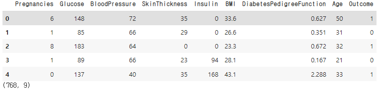
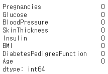
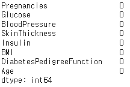
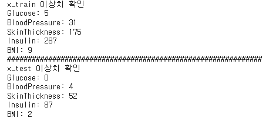

# Pima Indians Diabetes

> 당뇨병 여부 판단
>
> 이상치 처리 (Glucose, BloodPressure, SkinThickness, Insulin, BMI가 0인 값)
>
>[참고] 작업형2 문구
>
> - 출력을 원하실 경우 print() 함수 활용
>
> - 예시) print(df.head())
>
> - getcwd(), chdir() 등 작업 폴더 설정 불필요
>
> - 파일 경로 상 내부 드라이브 경로(C: 등) 접근 불가
> 
> 데이터 파일 읽기 예제
>
>- import pandas as pd
>
>- X_test = pd.read_csv("data/X_test.csv")
>
> - X_train = pd.read_csv("data/X_train.csv")
>
> - y_train = pd.read_csv("data/y_train.csv")
>
> 답안 제출 참고
>
> - 아래 코드 예측변수와 수험번호를 개인별로 변경하여 활용
>
>- pd.DataFrame({'cust_id': X_test.cust_id, 'gender': pred}).to_csv('003000000.csv', index=False)

```python
# 라이브러리, 데이터 불러오기
import pandas as pd
from sklearn.model_selection import train_test_split

df = pd.read_csv('.../PIMA/diabetes.csv')

# test용 데이터가 없기 때문에 train_test_split를 이용해 데이터를 나눈다.
x_train, x_test = train_test_split(df, test_size = 0.2, shuffle = True, random_state = 2021)

y_train = x_train['Outcome']
x_train = x_train.drop(['Outcome'], axis = 1)

y_test = x_test['Outcome']
x_test = x_test.drop(['Outcome'], axis = 1)

# x_train.shape, y_train.shape, x_test.shape, y_test.shape
```



```python
# 결측치가 있는지 확인
print(x_train.isnull().sum())
print(x_test.isnull().sum())
```

    

```python
# 당뇨병 여부 판단 이상치 처리 (Glucose, BloodPressure, SkinThickness, Insulin, BMI가 0인 값)
# train, test 각 컬럼에 이상치(=0)인 값들을 확인

#Train
print('x_train 이상치 확인')
print('Glucose:',len(x_train[x_train['Glucose']==0]))
print('BloodPressure:',len(x_train[x_train['BloodPressure']==0]))
print('SkinThickness:',len(x_train[x_train['SkinThickness']==0]))
print('Insulin:',len(x_train[x_train['Insulin']==0]))
print('BMI:',len(x_train[x_train['BMI']==0]))

print('##############################################################')
#Test
print('x_test 이상치 확인')
print('Glucose:',len(x_test[x_test['Glucose']==0]))
print('BloodPressure:',len(x_test[x_test['BloodPressure']==0]))
print('SkinThickness:',len(x_test[x_test['SkinThickness']==0]))
print('Insulin:',len(x_test[x_test['Insulin']==0]))
print('BMI:',len(x_test[x_test['BMI']==0]))
```



```python
# train에만 Glucose가 0인 값들이 있기 때문에 train에 있는 Glucose가 0인 행을 삭제한다.
idx = x_train[x_train['Glucose'] == 0].index

print(x_train.shape) # (614,8)
print(y_train.shape) # (614,)
x_train = x_train.drop(index= idx, axis=0)
y_train = y_train.drop(index= idx, axis=0)
print(x_train.shape) # (609,8)
print(y_train.shape) # (609,8)
```

```python
# 다른 컬럼의 이상치 값들을 각 컬럼의 평균값으로 대체한다.

cols = ['BloodPressure','SkinThickness','Insulin','BMI']

cols_mean = x_train[cols].mean()
x_train[cols].replace(0, cols_mean)

cols_mean = x_test[cols].mean()
x_test[cols].replace(0, cols_mean)
```

```python
# Scaling
from sklearn.preprocessing import minmax_scale

x_train_scale = minmax_scale(x_train)
x_test_scale = minmax_scale(x_test)

display(x_train.head())
display(pd.DataFrame(x_train_scale, columns=x_train.columns).head())
```


## 모델 분석

```python
from sklearn.linear_model import LogisticRegression
from sklearn.tree import DecisionTreeClassifier
from sklearn.ensemble import RandomForestClassifier
from sklearn.neighbors import KNeighborsClassifier
from sklearn.svm import SVC

# 각 sklearn의 분석 모델, 분석 및 예측 결과 score

# 로지스틱
lr = LogisticRegression(C =30, random_state = 0)
lr.fit(x_train_scale, y_train) # 학습과정
print('LogisticRegression score : ', lr.score(x_train_scale, y_train)) # 정확도
# LogisticRegression score :  0.7783251231527094

# decision tree
dtree = DecisionTreeClassifier(random_state = 0, max_depth = 40)
dtree.fit(x_train_scale, y_train)
print('dt score : ', dtree.score(x_train_scale, y_train))
# dt score :  1.0

# 랜덤 포레스트
rf = RandomForestClassifier(random_state = 2022, n_estimators = 250, max_depth = 10)
rf.fit(x_train_scale, y_train)
print('rf score : ', rf.score(x_train_scale, y_train))
# rf score :  0.8669950738916257

# k - mean
kn = KNeighborsClassifier(n_neighbors = 5, metric = 'euclidean')
kn.fit(x_train_scale, y_train) 
print('kn score : ', kn.score(x_train_scale, y_train))
# kn score :  0.7947454844006568

svc = SVC(C = 20, gamma = 3, random_state = 0, probability =True)
svc.fit(x_train_scale, y_train)
print('svc score : ', svc.score(x_train_scale, y_train))
# svc score :  0.8784893267651889
```

```python
pred = round(lr.score(x_test_scale,y_test)*100,2)
print('score : ', pred)
# score :  80.52

pred = round(dtree.score(x_test_scale,y_test)*100,2)
print('score : ', pred)
# score :  66.23

pred = round(rf.score(x_test_scale,y_test)*100,2)
print('score : ', pred)
# score :  77.27

pred = round(kn.score(x_test_scale,y_test)*100,2)
print('score : ', pred)
# score :  71.43

pred = round(svc.score(x_test_scale,y_test)*100,2)
print('score : ', pred)
# score :  68.83
```


### 다른 Scaler 사용

```python
from sklearn.preprocessing import StandardScaler
scaler = StandardScaler()
x_train_scale_ss = scaler.fit_transform(x_train)
x_test_scale_ss = scaler.fit_transform(x_test)
```

```python
from sklearn.linear_model import LogisticRegression
from sklearn.tree import DecisionTreeClassifier
from sklearn.ensemble import RandomForestClassifier
from sklearn.neighbors import KNeighborsClassifier
from sklearn.svm import SVC

# 각 sklearn의 분석 모델, 분석 및 예측 결과 score

# 로지스틱
lr = LogisticRegression(C =30, random_state = 0)
lr.fit(x_train_scale_ss, y_train) # 학습과정
print('LogisticRegression score : ', lr.score(x_train_scale_ss, y_train)) # 정확도
# LogisticRegression score :  0.7783251231527094

# decision tree
dtree = DecisionTreeClassifier(random_state = 0, max_depth = 40)
dtree.fit(x_train_scale_ss, y_train)
print('dt score : ', dtree.score(x_train_scale_ss, y_train))
# dt score :  1.0

# 랜덤 포레스트
rf = RandomForestClassifier(random_state = 2022, n_estimators = 250, max_depth = 10)
rf.fit(x_train_scale_ss, y_train)
print('rf score : ', rf.score(x_train_scale_ss, y_train))
# rf score :  0.8669950738916257

# k - mean
kn = KNeighborsClassifier(n_neighbors = 5, metric = 'euclidean')
kn.fit(x_train_scale_ss, y_train) 
print('kn score : ', kn.score(x_train_scale_ss, y_train))
# kn score :  0.7947454844006568

svc = SVC(C = 20, gamma = 3, random_state = 0, probability =True)
svc.fit(x_train_scale_ss, y_train)
print('svc score : ', svc.score(x_train_scale_ss, y_train))
# svc score :  0.8784893267651889
```

```python
pred = round(lr.score(x_test_scale_ss,y_test)*100,2)
print('score : ', pred)
# score :  80.52

pred = round(dtree.score(x_test_scale_ss,y_test)*100,2)
print('score : ', pred)
# score :  66.23

pred = round(rf.score(x_test_scale_ss,y_test)*100,2)
print('score : ', pred)
# score :  77.27

pred = round(kn.score(x_test_scale_ss,y_test)*100,2)
print('score : ', pred)
# score :  71.43

pred = round(svc.score(x_test_scale_ss,y_test)*100,2)
print('score : ', pred)
# score :  68.83
```


> 어떤 `Scaler`를 사용하느냐에 따라서 같은 모델이라도 다른 정확도를 보여준다.