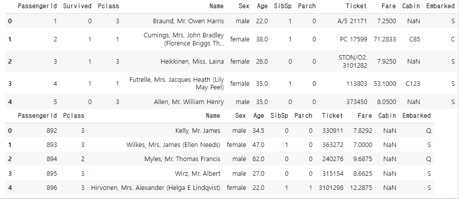
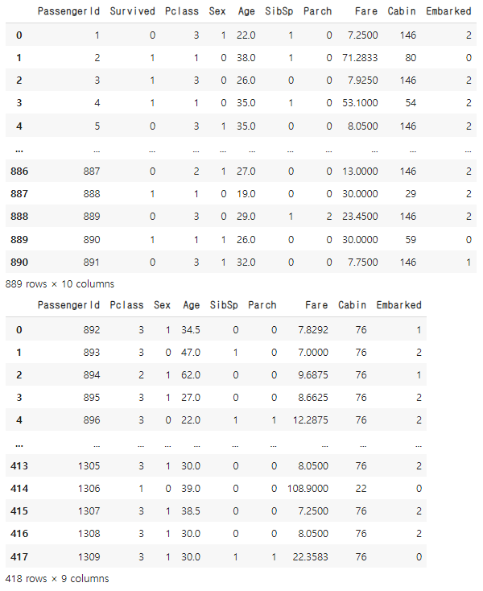
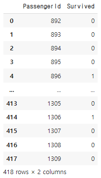

# [실기 준비] 타이타닉 예측 모델

> 생존여부 예측모델 만들기 
>
> 학습용 데이터 (X_train, y_train)을 이용하여 생존 예측 모형을 만든 후, 이를 평가용 데이터(X_test)에 적용하여 얻은 예측값을 다음과 같은 형식의 CSV파일로 생성하시오(제출한 모델의 성능은 accuracy 평가지표에 따라 채점) (가) 제공 데이터 목록 
>
> y_train: 생존여부(학습용) X_trian, X_test : 승객 정보 (학습용 및 평가용) (나) 데이터 형식 및 내용 y_trian (712명 데이터) 시험환경 세팅은 예시문제와 동일한 형태의 X_train, y_train, X_test 데이터를 만들기 위함임 
>
> 유의사항 성능이 우수한 예측모형을 구축하기 위해서는 적절한 데이터 전처리, 피처엔지니어링, 분류알고리즘, 하이퍼파라미터 튜닝, 모형 앙상블 등이 수반되어야 한다. 수험번호.csv파일이 만들어지도록 코드를 제출한다. 제출한 모델의 성능은 accuracy로 평가함

```python
# 라이브러리 및 파일 불러오기
import pandas as pd
import numpy as np

df = pd.read_csv('.../gender_submission.csv')

train = pd.read_csv('.../Titanic/train.csv')
test = pd.read_csv('.../Titanic/test.csv')

display(train.head())
display(test.head())
```



```python
# Name, Ticket 컬럼의 경우 분석에 큰 영향이 없기 때문에 제거

train.drop(['Name', 'Ticket'], axis = 1, inplace = True)
test.drop(['Name', 'Ticket'], axis = 1, inplace = True)
```

```python
# 결측치 제거
# print(train.isnull().sum())
# PassengerId      0
# Survived         0
# Pclass           0
# Sex              0
# Age            177
# SibSp            0
# Parch            0
# Fare             0
# Cabin          687
# Embarked         2
# dtype: int64
train.dropna( subset = ['Embarked'], inplace=True)

# Sex, Cabin, Embarked의 laberEnocoder
from sklearn.preprocessing import LabelEncoder

train['Cabin'] = LabelEncoder().fit_transform(train['Cabin'])
test['Cabin'] = LabelEncoder().fit_transform(test['Cabin'])

train['Sex'] = LabelEncoder().fit_transform(train['Sex'])
test['Sex'] = LabelEncoder().fit_transform(test['Sex'])

train['Embarked'] = LabelEncoder().fit_transform(train['Embarked'])
test['Embarked'] = LabelEncoder().fit_transform(test['Embarked'])

# Age 컬럼 결측치 평균값으로 대체
train['Age'].fillna(int(train['Age'].mean()), inplace = True)
test['Age'].fillna(int(test['Age'].mean()), inplace = True)

train['Fare'].fillna(int(train['Fare'].mean()), inplace = True)
test['Fare'].fillna(int(test['Fare'].mean()), inplace = True)
```



## 모델 분석

```python
from sklearn.linear_model import LogisticRegression
from sklearn.tree import DecisionTreeClassifier
from sklearn.ensemble import RandomForestClassifier
from sklearn.neighbors import KNeighborsClassifier
from sklearn.svm import SVC
```

```python
# 분석 전 데이터 정리
# 승객 id 와 생존 결과는 예측 확인용으로 나눈다.
x_train = train.drop(['PassengerId', 'Survived'], axis = 1)
y_train = train[['PassengerId', 'Survived']]
y = y_train['Survived']

x_test = test.drop(['PassengerId'], axis = 1)
id = test.pop('PassengerId')
```

```python
# 각 sklearn의 분석 모델, 분석 및 예측 결과 score

# 로지스틱
lr = LogisticRegression(C =15, random_state = 0)
lr.fit(x_train, y) # 학습과정
print('LogisticRegression score : ', lr.score(x_train, y)) # 정확도
# 0.7975253093363329

# decision tree
dtree = DecisionTreeClassifier(random_state = 0, max_depth = 30)
dtree.fit(x_train, y)
print('dt score : ', dtree.score(x_train, y))
# 0.9820022497187851

# 랜덤 포레스트
rf = RandomForestClassifier(random_state = 2022, n_estimators = 250, max_depth = 5)
rf.fit(x_train, y)
print('rf score : ', rf.score(x_train, y))
# 0.8548931383577053

# k - mean
kn = KNeighborsClassifier(n_neighbors = 10, metric = 'euclidean')
kn.fit(x_train, y) 
print('kn score : ', kn.score(x_train, y))
# 0.7705286839145107

svc = SVC(C = 10, gamma = 5, random_state = 0, probability =True)
svc.fit(x_train, y)
print('svc score : ', svc.score(x_train, y))
# 0.9752530933633295
```

```python
# 실제 test 데이터와 결과를 비교해본 결과 
LogisticRegression : 0.9401913875598086
DecisionTreeClassifier : 0.7703349282296651
RandomForestClassifier : 0.9449760765550239
KNeighborsClassifier : 0.38995215311004783
SVC : 0.6363636363636364
```

> 예측모델에서 높은 정확도를 보였어도 실제 test 데이터에서 높은 정확도를 보인다고 할 수 없다.


## 결과 제출

```python
pred = rf.predict(x_test) 
pred = pd.DataFrame(pred, columns=['Survived'])

id = pd.DataFrame(id)

output = pd.concat([id,pred], axis= 1)
output.to_csv('.../Titanic/0000.csv', index = False)
# index = False를 설정하지 않으면 인덱스 번호를 포함해서 저장한다.
# 따라서 csv 형태가 418 rows * 3 columns 형태로 저장된다.
```




