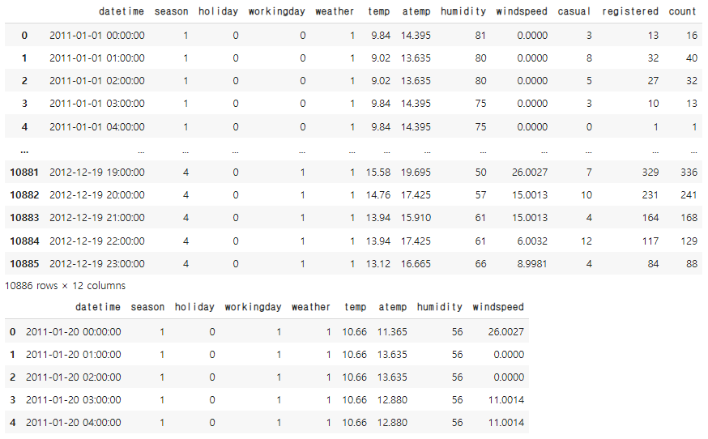
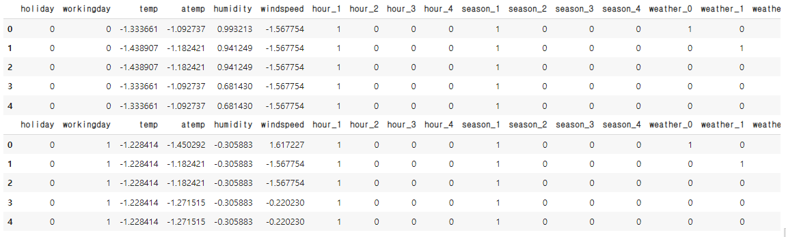
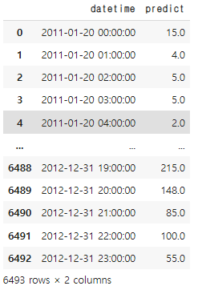

# [실기준비] 자전거 대여 예측

```python
import pandas as pd
import numpy as np

train = pd.read_csv('.../train.csv') 
test = pd.read_csv('.../test.csv')

display(train)
display(test.head())
```



```python
train['datetime'] = pd.to_datetime(train['datetime'])
test['datetime'] = pd.to_datetime(test['datetime'])

train['hour'] = train['datetime'].dt.hour
test['hour'] = test['datetime'].dt.hour
```

```python
train_y = train['count']
train_x = train.drop(['datetime','casual','registered','count'], axis = 1)

test_x = test.drop(['datetime'], axis = 1)

train_x[['season', 'weather','hour']] = train_x[['season', 'weather','hour']].astype('str')
test_x[['season', 'weather','hour']] = test_x[['season', 'weather','hour']].astype('str')

train_x = pd.get_dummies(train_x, ['hour','season','weather'])
test_x = pd.get_dummies(test_x, ['hour','season','weather'])
```

```python
from sklearn.preprocessing import StandardScaler

scaler = StandardScaler()
cols = ['temp', 'atemp', 'humidity', 'windspeed']
for col in cols:
  train_x[col] = scaler.fit_transform(train_x[[col]])
  test_x[col] = scaler.transform(test_x[[col]])


display(train_x)
display(test_x)
```



```python
from sklearn.ensemble import RandomForestRegressor
from xgboost import XGBRegressor
from sklearn.metrics import mean_squared_error

model = XGBRegressor(n_estimators = 50, max_depth = 50)
model.fit(train_x, train_y)

print(model.score(train_x,train_y))
# 0.9968992968952621
answer = pd.DataFrame(model.predict(test_x), columns=['predict'])
csv = pd.concat([test['datetime'],answer], axis = 1)
csv['predict'] = np.round((csv['predict']),0)
```



