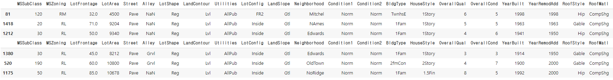

# [실기 준비] House-price 예측

> XGBRegressor을 이용해 집값을 예측하는 모델 제작

```python
# 자료 및 라이브러리 불러오기
# 준비된 상황 가정
import pandas as pd
import numpy as np
from sklearn.model_selection import train_test_split

def exam_data_load(df, target, id_name="", null_name=""):
    if id_name == "":
        df = df.reset_index().rename(columns={"index": "id"})
        id_name = 'id'
    else:
        id_name = id_name
    
    if null_name != "":
        df[df == null_name] = np.nan
    
    X_train, X_test = train_test_split(df, test_size=0.2, shuffle=True, random_state=2021)
    y_train = X_train[[id_name, target]]
    X_train = X_train.drop(columns=[id_name, target])
    y_test = X_test[[id_name, target]]
    X_test = X_test.drop(columns=[id_name, target])
    return X_train, X_test, y_train, y_test 
    
df = pd.read_csv(".../train.csv")
X_train, X_test, y_train, y_test = exam_data_load(df, target='SalePrice', id_name='Id')

X_train.shape, X_test.shape, y_train.shape, y_test.shape
```



```python
# X_train info
#   Column         Non-Null Count  Dtype  
# ---  ------         --------------  -----  
#  0   MSSubClass     1168 non-null   int64  
#  1   MSZoning       1168 non-null   object 
#  2   LotFrontage    956 non-null    float64
#  3   LotArea        1168 non-null   int64  
#  4   Street         1168 non-null   object 
#  5   Alley          70 non-null     object 
#  6   LotShape       1168 non-null   object 
#  7   LandContour    1168 non-null   object 
#  8   Utilities      1168 non-null   object 
#  9   LotConfig      1168 non-null   object 
#  10  LandSlope      1168 non-null   object 
#  11  Neighborhood   1168 non-null   object 
#  12  Condition1     1168 non-null   object 
#  13  Condition2     1168 non-null   object 
#  14  BldgType       1168 non-null   object 
#  15  HouseStyle     1168 non-null   object 
#  16  OverallQual    1168 non-null   int64  
#  17  OverallCond    1168 non-null   int64  
#  18  YearBuilt      1168 non-null   int64  
#  19  YearRemodAdd   1168 non-null   int64  
#  20  RoofStyle      1168 non-null   object 
#  21  RoofMatl       1168 non-null   object 
#  22  Exterior1st    1168 non-null   object 
#  23  Exterior2nd    1168 non-null   object 
#  24  MasVnrType     1162 non-null   object 
#  25  MasVnrArea     1162 non-null   float64
#  26  ExterQual      1168 non-null   object 
#  27  ExterCond      1168 non-null   object 
#  28  Foundation     1168 non-null   object 
#  29  BsmtQual       1139 non-null   object 
#  30  BsmtCond       1139 non-null   object 
#  31  BsmtExposure   1138 non-null   object 
#  32  BsmtFinType1   1139 non-null   object 
#  33  BsmtFinSF1     1168 non-null   int64  
#  34  BsmtFinType2   1139 non-null   object 
#  35  BsmtFinSF2     1168 non-null   int64  
#  36  BsmtUnfSF      1168 non-null   int64  
#  37  TotalBsmtSF    1168 non-null   int64  
#  38  Heating        1168 non-null   object 
#  39  HeatingQC      1168 non-null   object 
#  40  CentralAir     1168 non-null   object 
#  41  Electrical     1167 non-null   object 
#  42  1stFlrSF       1168 non-null   int64  
#  43  2ndFlrSF       1168 non-null   int64  
#  44  LowQualFinSF   1168 non-null   int64  
#  45  GrLivArea      1168 non-null   int64  
#  46  BsmtFullBath   1168 non-null   int64  
#  47  BsmtHalfBath   1168 non-null   int64  
#  48  FullBath       1168 non-null   int64  
#  49  HalfBath       1168 non-null   int64  
#  50  BedroomAbvGr   1168 non-null   int64  
#  51  KitchenAbvGr   1168 non-null   int64  
#  52  KitchenQual    1168 non-null   object 
#  53  TotRmsAbvGrd   1168 non-null   int64  
#  54  Functional     1168 non-null   object 
#  55  Fireplaces     1168 non-null   int64  
#  56  FireplaceQu    615 non-null    object 
#  57  GarageType     1107 non-null   object 
#  58  GarageYrBlt    1107 non-null   float64
#  59  GarageFinish   1107 non-null   object 
#  60  GarageCars     1168 non-null   int64  
#  61  GarageArea     1168 non-null   int64  
#  62  GarageQual     1107 non-null   object 
#  63  GarageCond     1107 non-null   object 
#  64  PavedDrive     1168 non-null   object 
#  65  WoodDeckSF     1168 non-null   int64  
#  66  OpenPorchSF    1168 non-null   int64  
#  67  EnclosedPorch  1168 non-null   int64  
#  68  3SsnPorch      1168 non-null   int64  
#  69  ScreenPorch    1168 non-null   int64  
#  70  PoolArea       1168 non-null   int64  
#  71  PoolQC         5 non-null      object 
#  72  Fence          231 non-null    object 
#  73  MiscFeature    44 non-null     object 
#  74  MiscVal        1168 non-null   int64  
#  75  MoSold         1168 non-null   int64  
#  76  YrSold         1168 non-null   int64  
#  77  SaleType       1168 non-null   object 
#  78  SaleCondition  1168 non-null   object 
# dtypes: float64(3), int64(33), object(43)
# memory usage: 730.0+ KB
```

# Simple Preprocessing

```python
from sklearn.impute import SimpleImputer

X_train = X_train.select_dtypes(exclude=['object'])
X_test = X_test.select_dtypes(exclude=['object'])
target = y_train['SalePrice']

# 결측치 처리
imp = SimpleImputer()
X_train = imp.fit_transform(X_train)
X_test = imp.transform(X_test)
```

```python
idx1 = y_train['SalePrice'].quantile(0.005)>y_train['SalePrice']
idx2 = y_train['SalePrice'].quantile(0.995)<y_train['SalePrice']

y_train = y_train[~(idx1 + idx2)]
X_train = X_train[~(idx1 + idx2)]
target = y_train[~(idx1 + idx2)]['SalePrice']
```

```python
from sklearn.model_selection import train_test_split
X_tr, X_val, y_tr, y_val = train_test_split(X_train, target, test_size=0.15, random_state=2022)
X_tr.shape, X_val.shape, y_tr.shape, y_val.shape
#((992, 36), (176, 36), (992,), (176,))
```


## XGBRegressor

```python
from xgboost import XGBRegressor

model = XGBRegressor(n_estimators=100, max_depth=4, colsample_bytree=0.9)
model.fit(X_tr, y_tr, verbose=False)
pred = model.predict(X_val)
```

> 파라미터
>
> - n_estimators : 생성할 weak learner의 수, learning_rate가 낮을 때 높여야 과적합 방지, default : 100
> - max_depth : 트리의 Max depth, default : 6
> - colsample_bytree : 각 트리별 사용된 feature Percentage. 값이 낮을 수록 과적합 방지, default : 1
>
> 과적합 방지
>
> - learning rate 낮추기 , 이때 n_estimators 높여야 한다
> - max_depth 낮추기
> - min_chile_weight 높이기 (min_chile_weight  : 관측치에 대한 가중치 합의 최소, default :1)
> - gamma 높이기 등등

```python
# 성능 측정 지표
from sklearn.metrics import mean_squared_error

def rmsle(y, y_pred):
    return np.sqrt(mean_squared_error(y, y_pred))

print("RMSLE : " + str(rmsle(y_val, pred)))
```

> mean_squared_error : 실제 값과 예측 값의 차이를 제곱해 평균화
>
> RMSE : MSE 값은 오루의 제곱을 구하므로 실제 오류 평균보다 더 커지는 특성이 있어 MSE에 루트를 씌운 RMSE 값을 사용


##  저장

```python
# CSV 저장
pred = model.predict(X_test)
output = pd.DataFrame({'Id': y_test['Id'], 'SalePrice': pred})
output.head()
output.to_csv("000000.csv", index=False)
```

